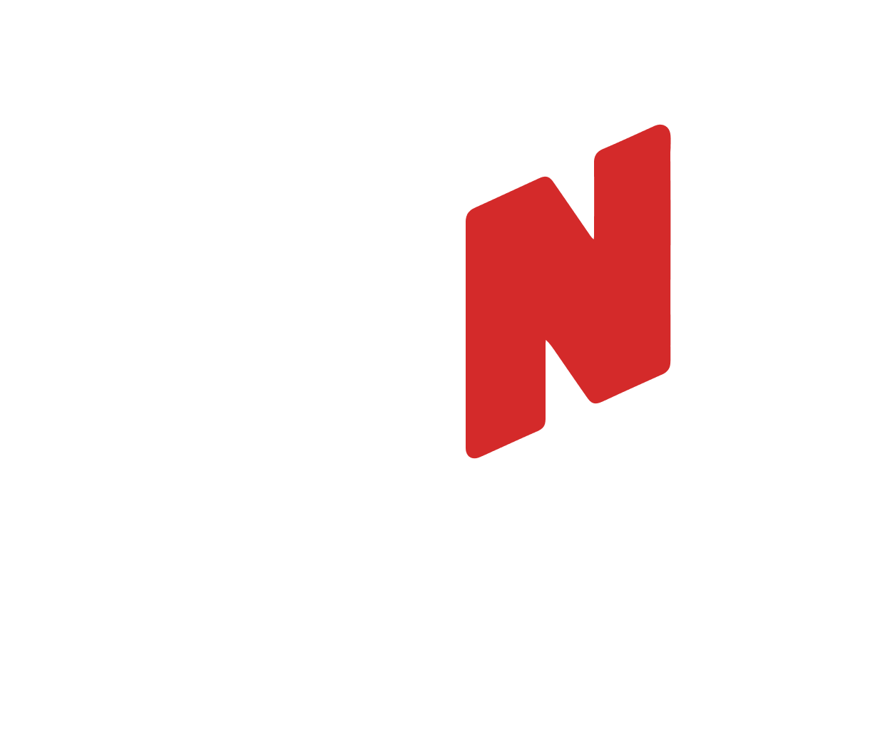

  
   

  
<strong>Create Studio-Quality AI Voices — Locally, Privately, Unlimited.</strong>

  

    
    
    
  

  

    
    
    
    
    
    
  

---

## What is Open Narrator?

Open Narrator is a powerful AI-powered Text-to-Speech (TTS) engine that runs **entirely on your local machine**. Generate natural, expressive, human-like voices without cloud APIs, per-token billing, or privacy trade-offs.

> Built for creators. Powered by openness.

---

## Features

### 🎙️ Natural AI Voices
- 20+ high-quality voices — American, British, and Indian English + Hindi
- 2 advanced **emotion-enabled voices** built for realistic narration

### ⚡ Parallel Processing
- Generate multiple voice outputs simultaneously
- Optimized for long scripts and batch jobs

### 👥 Group Speaking
- Assign multiple speakers within a single script
- Perfect for dialogues, podcasts, storytelling, and audiobooks

<!-- ### 🎭 Super Emotions
- Emotion-aware voice synthesis — not just reading, *performing*
- Supports: Happiness · Sadness · Anger · Excitement -->

### 🎬 Built-in Video Editor
Turn generated audio into ready-to-publish content:
- Social media videos
- Audiobooks
- Product demos
- Marketing creatives

---

## Why Open Narrator?

### 💸 No Per-Token Pricing

| Plan | Price | Usage |
|------|-------|-------|
| Free-tire | ₹0.00 | Unlock all features and use it for free for the 1st month|
| Pro (India) | ₹299 | Unlimited lifetime generation |

Most TTS platforms charge per word — costs scale fast. Open Narrator doesn't.

### 🔒 Privacy-First Architecture
- Runs fully **offline** — no internet required after setup
- Zero data collection or cloud dependency
- Your scripts never leave your machine

### 🛠️ Built for Creators
Not a generic API. Designed for real content pipelines:
- Content creators & YouTubers
- Developers & indie hackers
- Businesses & agencies
- Audiobook producers

---

## System Requirements

| | Minimum | Recommended |
|-|---------|-------------|
| RAM | 8 GB | 16 GB |
| Processing | CPU | GPU (for faster rendering) |

---

## Installation

> Coming soon — beta launching shortly.

## License

Most of the project is open-source. Specific components may carry separate licenses — see individual module documentation for details.

---

## Support the Project

If Open Narrator is useful to you:

- ⭐ Star this repo
- 📢 Share it with fellow creators
- 🛠️ Contribute to development

---

<!-- 

  <strong>Open Narrator — Your Voice, Your Control.</strong>
   
  <a href="https://opennarrator.sh">opennarrator.sh</a> · <a href="mailto:contact@opennarrator.sh">contact@opennarrator.sh</a>

 -->
